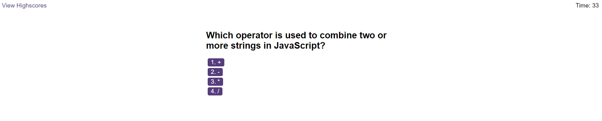

# interactive-quiz-coding-JS
A timed quiz on JavaScript fundamentals that stores high scores.

This quiz is designed to test your knowledge of essential JavaScript concepts and syntax.

## Preview

## How to Run the Quiz
To run the quiz, follow these steps:

-Open the quiz HTML file (index.html) in your web browser.

-Start the quiz and answer the questions.

-After completing the quiz, you will receive your score.

Deployed Link: https://b70b70.github.io/interactive-quiz-coding-JS/

This quiz was created by Faheem Ali